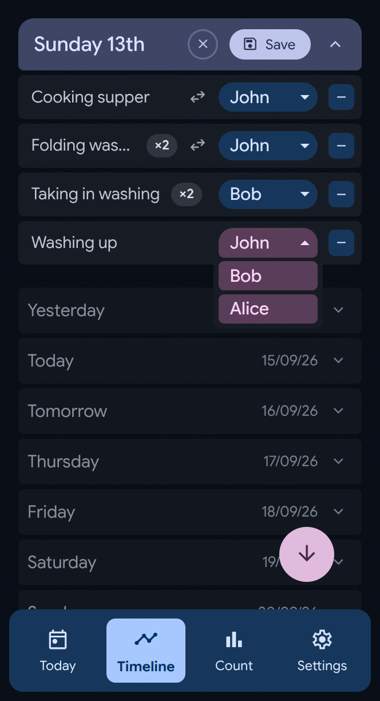
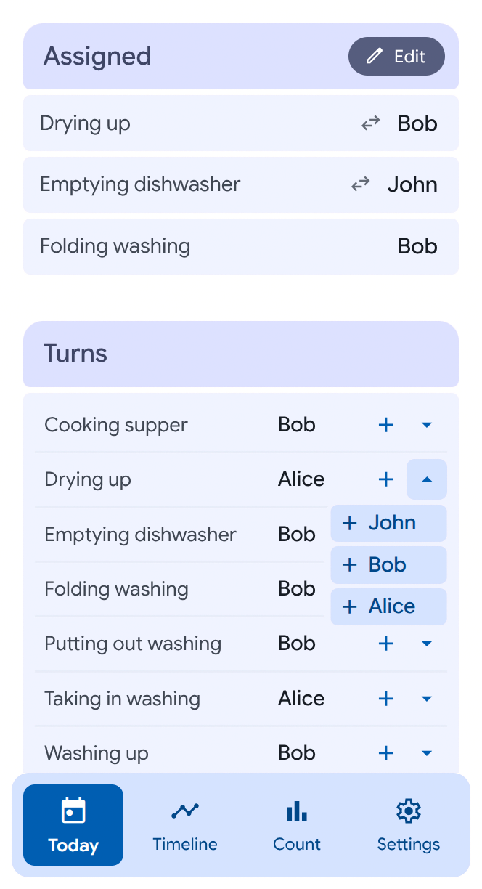
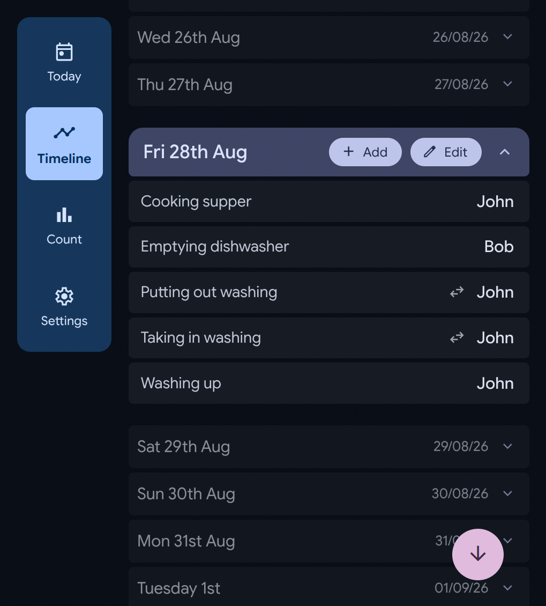
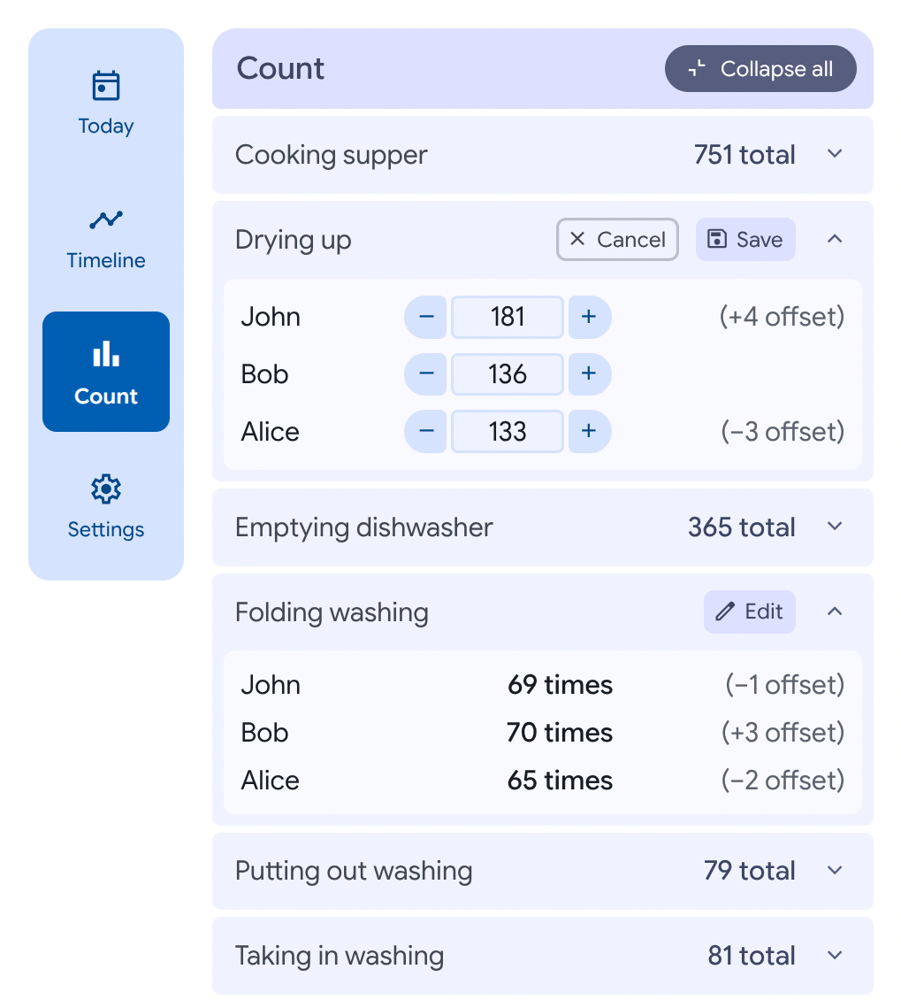

    <picture>
        <source
            media="(prefers-color-scheme: light)"
            srcset="app/client/src/assets/icons/light/word-logo.svg" 
            width="500" 
            height="135"></source>
        <source
            media="(prefers-color-scheme: dark)"
            srcset="app/client/src/assets/icons/dark/word-logo.svg" 
            width="500" 
            height="135"></source>
        
    </picture>
    <h3>Chores Sync is a simple web app for sharing chores (work in progress).</h3>

 

Client and server is written in [TypeScript](https://www.typescriptlang.org/).
[Lit](https://lit.dev/) is used for web components.
[Neon Postgres](https://neon.com/) is used for the database, with [Cloudflare Workers](https://www.cloudflare.com/products/workers/).
Icons used are [Material Symbols](https://fonts.google.com/icons).

### Screenshots

    
    

    
    

### To do
1.  Add automatic offsetting of inactive members to cron worker.
2.  Fix desync between assignments list in `<assignments-list>` and `<turns-list>` components.
3.  Make quantity in assignments edit mode editable.
4.  Show dialog when there is an error rather than showing a loading then success/error state to remove need for saving changes (they can be autosaved and reverted on an error instead)
5.  Set up individual user authentication rather than having a shared secret.
6.  Make caching more tightly linked to db functions.
7.  Add notifications.
8.  Add order column to chores table so they can be grouped in a way that makes sense.
9.  Set up sign up so anyone can create an account, invite people etc.