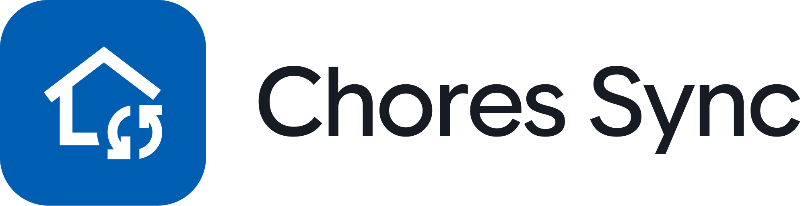
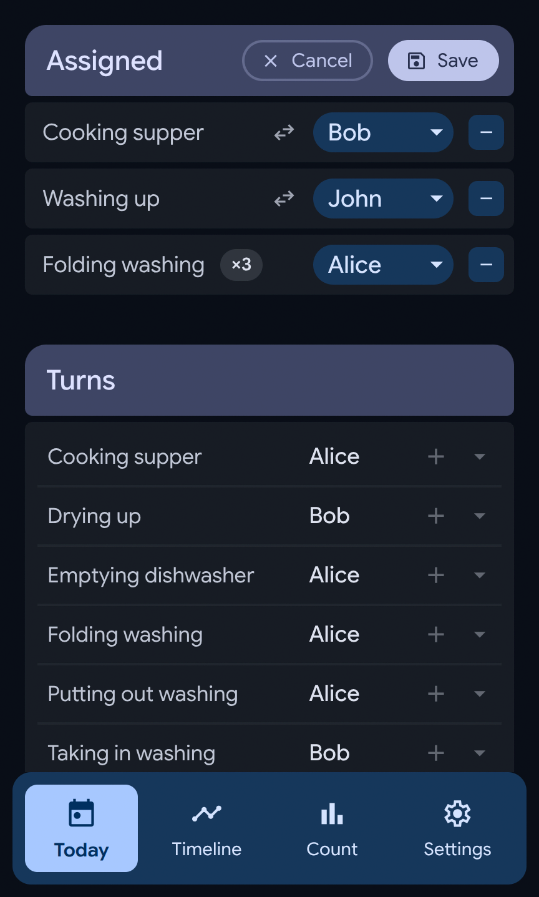
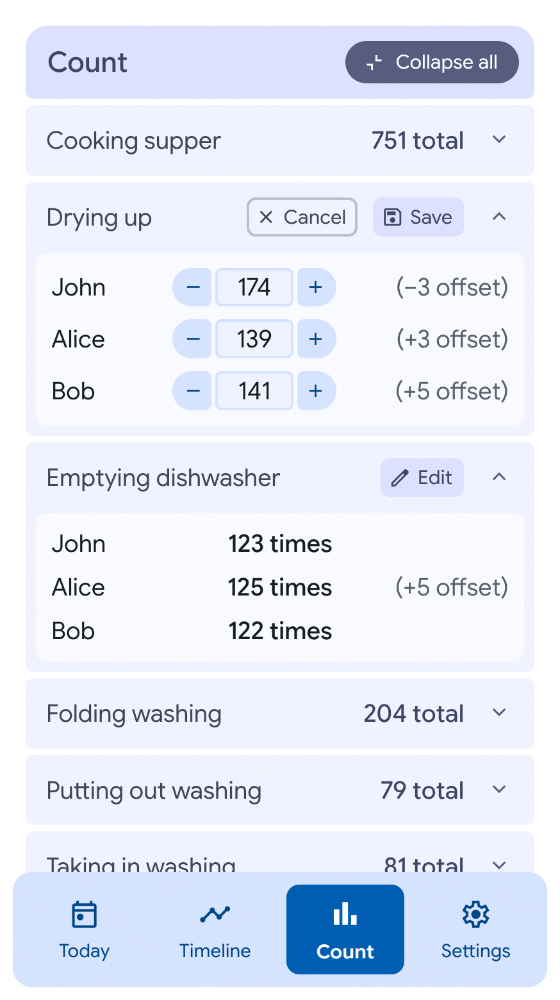
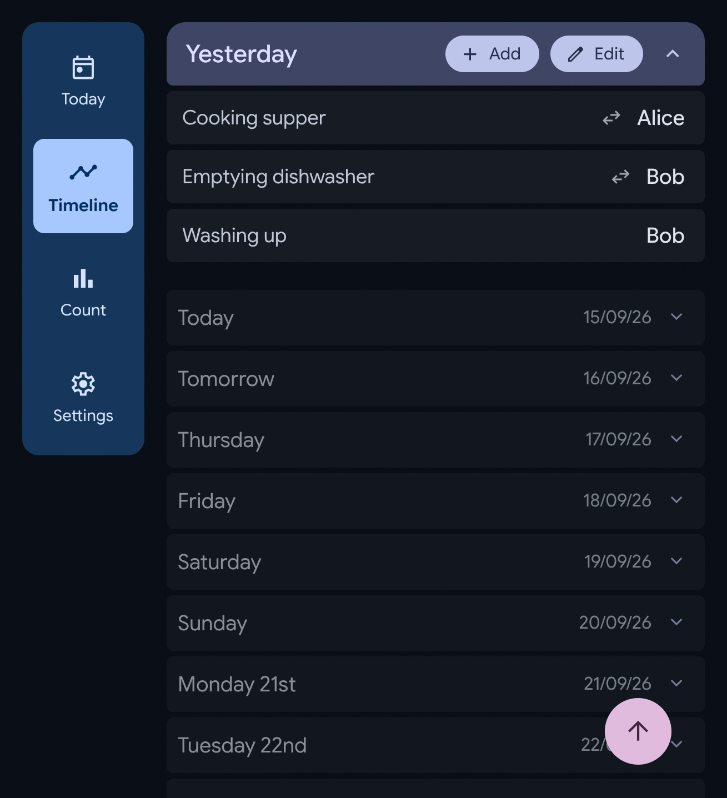
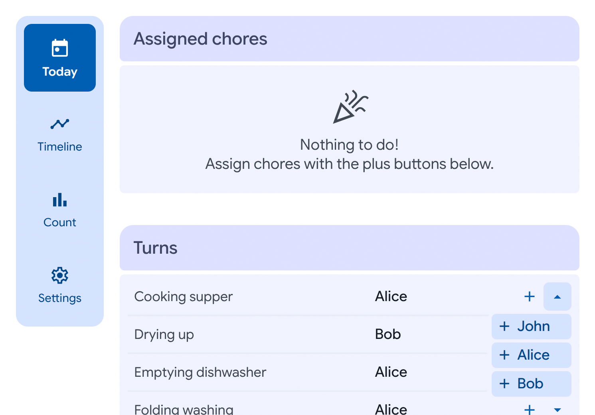

    <picture>
        <source
            media="(prefers-color-scheme: light)"
            srcset="app/client/src/assets/icons/light/word-logo.svg" 
            width="500" 
            height="160"></source>
        <source
            media="(prefers-color-scheme: dark)"
            srcset="app/client/src/assets/icons/dark/word-logo.svg" 
            width="500" 
            height="160"></source>
        
    </picture>
    <h4>Chores Sync is a simple web app for sharing chores (still a work in progress).</h4>

 

Client and server is written in [TypeScript](https://www.typescriptlang.org/).
[Lit](https://lit.dev/) is used for web components.
[Neon Postgres](https://neon.com/) is used for the database, with [Cloudflare Workers](https://www.cloudflare.com/products/workers/).
Icons used are [Material Symbols](https://fonts.google.com/icons).

### Screenshots

    
    

    
    

### Todo
1.  Fix state actions transitioning scale when saving a count edit.
2.  Fix timeline section add dialog not appearing on Safari.
3.  Begin settings section (initially just for setting user active state).
4.  Make quantity in assignments edit mode editable.
5.  Set up individual user authentication rather than having a shared secret.
6.  Make caching more tightly linked to db functions.
7.  Add notifications.
8.  Add order column to chores table so they can be grouped in a way that makes sense.
9.  Set up sign up so anyone can create an account, invite people etc.